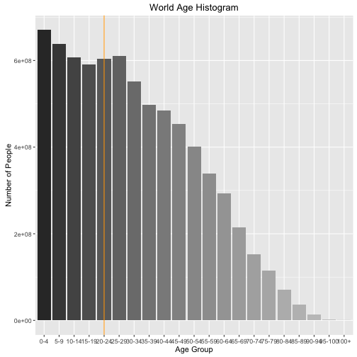
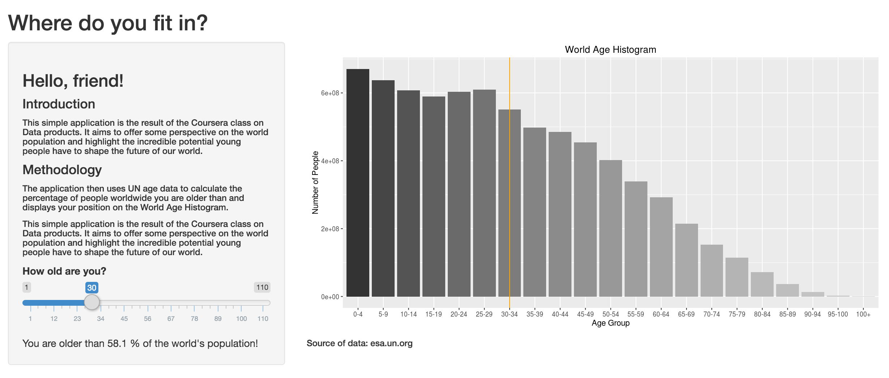

A tiny app for a big world.
========================================================
author: Rok Hrzic
date: April 3rd 2016
autosize: true
transition: linear

Introduction
========================================================

This application pitch has been created for the Data products course on Coursera.

The aim of our tiny app is simple: to open our eyes to how trully young the world is and show us where we might fit in.

I owe my gratitude to the United Nations' Department of Economic and Social Affairs and Population Division for making their data freely available online. For more information: http://esa.un.org/.

Methodology
========================================================

The application asks the user to input their age via a slider. The application then determines the age group of the user and feeds back two pieces of information:

- the (approximate) percentage of the world's population the user is older than
- the position of that age group on a World Age Histogram

World Age Histogram
========================================================

Where do you fit in?
========================================================
So, where can you find this fun little thought experiment?
Visit rokhrzic.shinyapps.io/data_products/

Complete source: github.com/rhrzic/data_products

